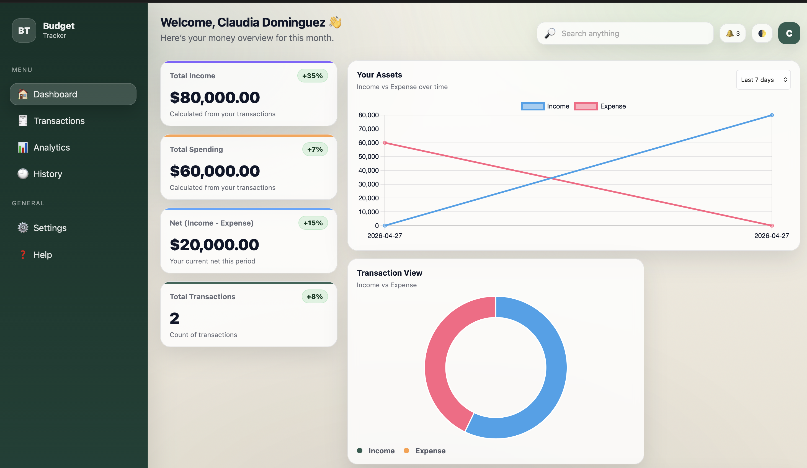

# Budget Tracker Web App

A modern personal finance web application designed to help users track income, manage expenses, and gain better control over their money through an interactive dashboard and visual analytics.



> A clean budgeting experience focused on simplicity, clarity, and smart financial awareness.

---

## Overview

The Budget Tracker Web App was created to provide users with an easy way to organize their finances in one place. Instead of manually tracking spending through spreadsheets or notes, users can monitor transactions, review balances, and visualize financial activity through charts and summaries.

This project highlights practical front-end development skills including JavaScript logic, dynamic UI rendering, responsive design, and data visualization.

---

## Key Features

### Financial Management
- Add income transactions
- Add expense transactions
- Automatically calculate total balance
- Track available funds in real time
- Organize spending activity

### Dashboard & Analytics
- Interactive charts and graphs
- Spending summaries
- Income vs expense insights
- Visual budgeting metrics

### User Experience
- Secure login / authentication interface
- Clean and intuitive layout
- Responsive design for desktop and mobile
- Fast and lightweight performance

---

## Tech Stack

### Frontend
- HTML5
- CSS3
- JavaScript (ES6+)

### Development Tools
- Git
- GitHub
- VS Code

---

## Why This Project Matters

Managing finances is one of the most common real-world problems. This project demonstrates how software can solve everyday challenges through automation, organization, and better visibility into personal spending habits.

It also reflects the type of dashboards and reporting systems commonly used in business environments.

---

## Project Structure

```text
Budget-Tracker-Web-App/
│── index.html
│── style.css
│── script.js
│── assets/
│   └── screenshot.png
│── README.md
